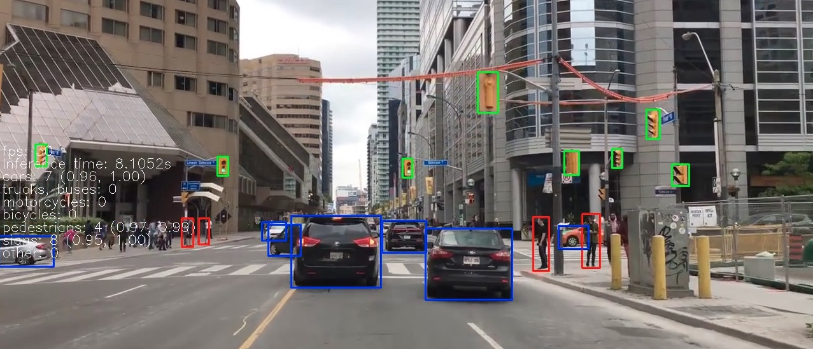

# General Object Detector
Our program that allows you to select which object detection model to use to detect objects.

We currently support the models:
* [SSD](https://arxiv.org/abs/1512.02325) with [MobileNet](https://arxiv.org/abs/1704.04861)
* [SSD](https://arxiv.org/abs/1512.02325) with [VGG-16](https://arxiv.org/abs/1409.1556)
* [Detr](https://arxiv.org/abs/2005.12872)
* [Faster R-CNN](https://arxiv.org/abs/1506.01497)
* [YOLO](https://arxiv.org/abs/1804.02767)

The SSD model is taken from [here](https://github.com/qfgaohao/pytorch-ssd).
The YOLO model is taken from [here](https://github.com/ultralytics/yolov5).





## Dependencies and setup
* Python ≥ 3.7.10
* OpenCV2
* PyTorch ≥ 1.7.1
* Torchvision ≥ 0.8.2

To use the video function place `.mp4` videos into the folder `media/DrivingClips`.

## Usage
To use the detector with for example SSD Mobilenet on file video.mp4, type:

```
run.py -ssdm video
```
To use it with the webcam just ommit the filename:
```
run.py -ssdm
```
Running the command
```
run.py
```
without any arguments just opens the webcam and displays its output.

To write information about the model like the minimum detection confidence or inference time to a file, use the optional argument `-l`. Example:

```
run.py -ssdm video -l
```